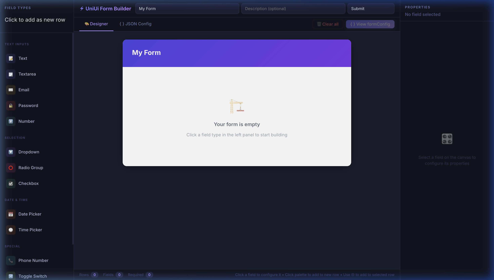
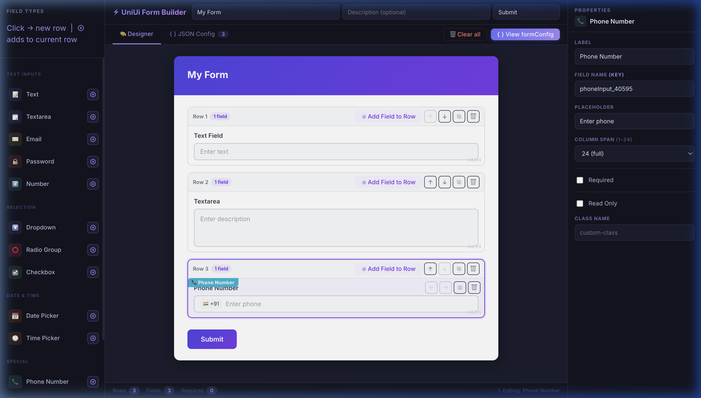
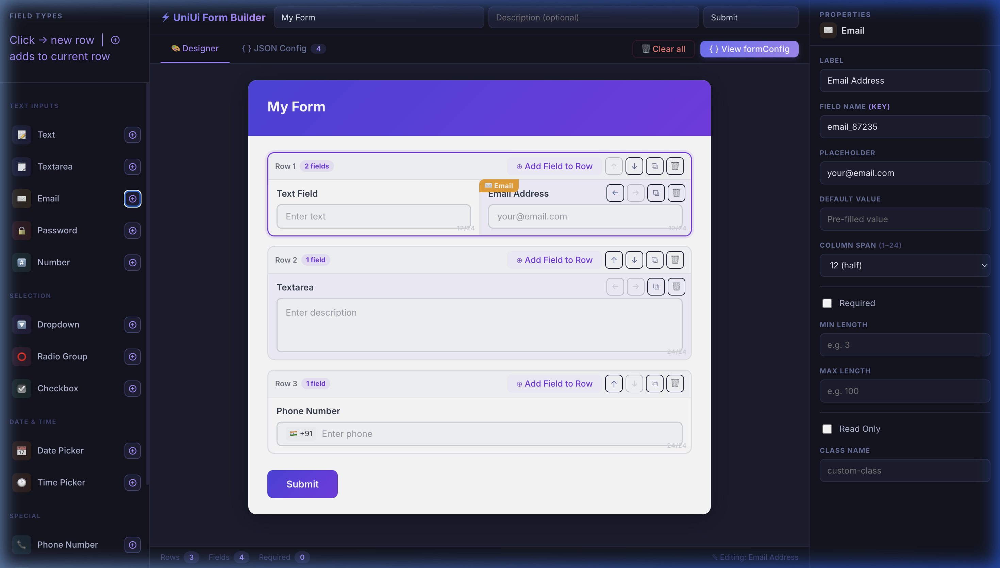
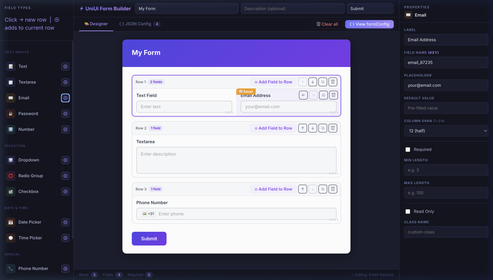
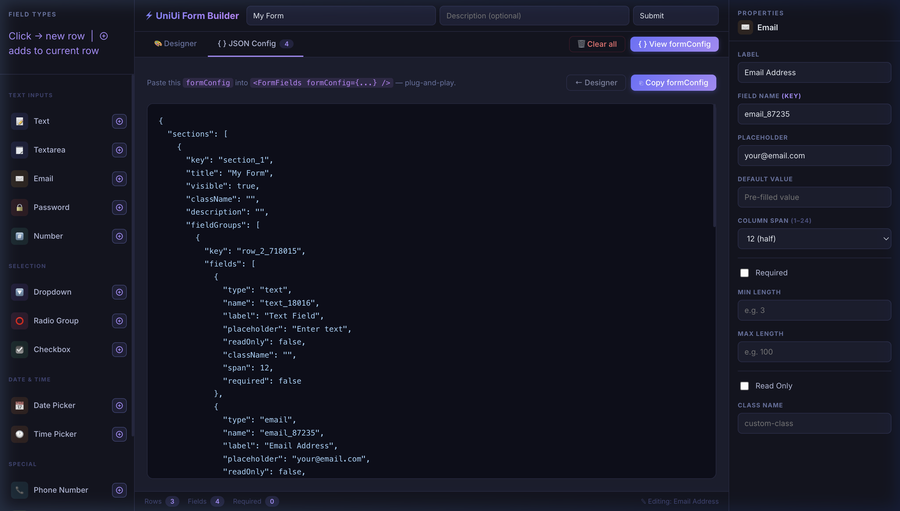

# 🏗️ UniUi Form Builder

> Build powerful, dynamic forms with **UniUi** — a React + Ant Design form builder library. This guide covers how to use the visual builder, all supported field types, and how to export a plug-and-play `formConfig`.

---

## 🎨 Visual Form Builder (No-Code)

UniUi ships with a **SurveyJS-style visual Form Builder** — a full-screen, no-code editor to design, preview, and export forms in minutes.

### How to launch it

```jsx
import { FormBuilder } from 'uni-ui-form-builder';

export default function App() {
  return <FormBuilder />;   // full-screen 3-panel UI
}
```

Or with an export callback:
```jsx
<FormBuilder onExport={(formConfig) => console.log(formConfig)} />
```

---

### 🖼️ Screenshots

#### Empty state — 3-panel layout


#### Designer tab — fields added as rows


#### Multi-field row — two fields side-by-side


#### Properties panel — configure selected field


#### JSON Config tab — copy-ready formConfig


---

### Builder UI — 3 Panels

| Panel | What it does |
|---|---|
| **Left — Field Palette** | Click to add as new row · ⊕ adds to selected row |
| **Center — Designer tab** | Live form preview with row management and drag-and-drop |
| **Center — 👁 Preview tab** | Fully interactive form — fill, validate, see submitted values |
| **Center — JSON tab** | Generated `formConfig` with ⎘ Copy to Clipboard |
| **Right — Properties** | Configure label, name, placeholder, required, min/max, options, span |

---

### ✨ Feature Highlights

#### Multi-field rows — fields side by side
Each row can hold **multiple fields** displayed side-by-side. Column widths are auto-distributed evenly (based on the 24-column grid) and can be adjusted individually in the Properties panel.

- Click any palette tile → adds a **new row** with that field
- Click **⊕ Add Field to Row** in a row's toolbar → adds into the **same row**
- Use the **⊕ button** that appears next to each palette tile when a row is selected

#### Drag-and-drop reordering
Drag any field (using the **⠿ handle**) to:
- **Insert before** another field in the same row
- **Move to a different row** (drop on the row)
- **Create a new standalone row** — drop onto the dashed drop zone that appears between rows

#### 👁 Interactive Preview mode
Switch to the **Preview tab** to see and interact with the real form:
1. Fill in the actual fields (real validation fires live)
2. Required, min/max length, and pattern rules show error messages
3. Hit **Submit** — the submitted values appear on the right panel as JSON
4. Hit **↺ Reset** to test again with different values

```jsx
// The same onSubmit prop works in your production code:
<FormFields
  formConfig={formConfig}
  onSubmit={(data) => console.log(data)}  // receives the form values on submit
/>
```

#### Duplicate fields and rows
- **⧉ on a field** — duplicates it in the same row (with `_copy` suffix on name)
- **⧉ on a row toolbar** — duplicates the entire row (all fields) below it

---

### Workflow

1. **Add fields** — click tiles in the left palette  
2. **Multi-column rows** — hit ⊕ in a row's toolbar or the ⊕ next to a palette tile  
3. **Drag to rearrange** — drag fields between rows or reorder within a row  
4. **Configure** — click any field → edit properties on the right panel  
5. **Preview** — switch to 👁 Preview to fill the form and test validation  
6. **Export** — switch to `{ }` JSON Config, then hit **⎘ Copy formConfig**  
7. **Use it** — paste into your production code:

```jsx
import { FormFields } from 'uni-ui-form-builder';
const formConfig = { /* paste here */ };

<FormFields formConfig={formConfig} onSubmit={(data) => save(data)} />
```

---

### Supported Field Types

| Group | Types |
|---|---|
| **Text Inputs** | Text, Textarea, Email, Password, Number |
| **Selection** | Dropdown, Radio Group, Checkbox |
| **Date & Time** | Date Picker, Time Picker |
| **Special** | Phone Number, Toggle Switch, OTP Input, File Upload |

---


## 📦 Installation

```bash
# Install the package
npm install uni-ui-form-builder

# Or clone and run locally
git clone https://github.com/balasurendaran/UniUi.git
cd UniUi
npm install
npm run dev
```

**Peer dependencies required:**

```bash
npm install react react-dom antd react-hook-form
```

---

## ⚡ Quick Start

```jsx
import { FormBuilder } from 'uni-ui-form-builder';

const schema = [
  {
    type: 'text',
    name: 'full_name',
    label: 'Full Name',
    placeholder: 'Enter your name',
    required: true,
  },
  {
    type: 'email',
    name: 'email',
    label: 'Email Address',
    required: true,
  },
  {
    type: 'phone',
    name: 'phone',
    label: 'Phone Number',
  },
];

function MyForm() {
  const handleSubmit = (data) => {
    console.log('Form data:', data);
  };

  return (
    <FormBuilder
      schema={schema}
      onSubmit={handleSubmit}
    />
  );
}
```

---

## 🧩 Core Concepts

UniUi uses a **JSON schema** to define forms. Each field in the schema is an object with:

| Property | Type | Description |
|---|---|---|
| `type` | `string` | The field type (see below) |
| `name` | `string` | Unique field identifier / key in submitted data |
| `label` | `string` | Display label shown above the field |
| `placeholder` | `string` | Placeholder text inside the input |
| `required` | `boolean` | Whether the field is mandatory |
| `disabled` | `boolean` | Render field in disabled state |
| `defaultValue` | `any` | Pre-fill value on load |
| `rules` | `array` | Validation rules (react-hook-form compatible) |
| `options` | `array` | For select/radio/checkbox fields: `[{ label, value }]` |

---

## 🗂️ Supported Field Types

### Text Inputs

```jsx
// Single-line text
{ type: 'text', name: 'username', label: 'Username' }

// Multi-line textarea
{ type: 'textarea', name: 'bio', label: 'Bio', rows: 4 }

// Email
{ type: 'email', name: 'email', label: 'Email' }

// Password
{ type: 'password', name: 'password', label: 'Password' }

// Number
{ type: 'number', name: 'age', label: 'Age', min: 0, max: 120 }
```

### Phone Input

UniUi uses `antd-phone-input` for international phone number support with country code selection:

```jsx
{
  type: 'phone',
  name: 'contact_number',
  label: 'Phone Number',
  enableSearch: true,    // allow searching country codes
  country: 'in',         // default country (ISO 2-letter code)
}
```

### Selection Fields

```jsx
// Dropdown select
{
  type: 'select',
  name: 'country',
  label: 'Country',
  options: [
    { label: 'India', value: 'IN' },
    { label: 'USA',   value: 'US' },
  ],
  mode: 'single', // or 'multiple' for multi-select
}

// Radio group
{
  type: 'radio',
  name: 'gender',
  label: 'Gender',
  options: [
    { label: 'Male',   value: 'male' },
    { label: 'Female', value: 'female' },
    { label: 'Other',  value: 'other' },
  ],
}

// Checkbox group
{
  type: 'checkbox',
  name: 'interests',
  label: 'Interests',
  options: [
    { label: 'Sports',  value: 'sports' },
    { label: 'Music',   value: 'music' },
    { label: 'Travel',  value: 'travel' },
  ],
}

// Single toggle checkbox
{
  type: 'checkbox-single',
  name: 'agree_terms',
  label: 'I agree to the Terms & Conditions',
}
```

### Date & Time

```jsx
// Date picker
{
  type: 'date',
  name: 'dob',
  label: 'Date of Birth',
  format: 'DD/MM/YYYY',
}

// Date range
{
  type: 'date-range',
  name: 'travel_dates',
  label: 'Travel Period',
}
```

### Media Upload (Cloudinary)

UniUi integrates with Cloudinary for media uploads via `@cloudinary/react`:

```jsx
{
  type: 'image-upload',
  name: 'profile_photo',
  label: 'Profile Photo',
  cloudinaryConfig: {
    cloudName: 'your-cloud-name',
    uploadPreset: 'your-upload-preset',
  },
  maxFileSize: 5,    // MB
  accept: ['image/jpeg', 'image/png'],
}
```

### Toggle / Switch

```jsx
{
  type: 'switch',
  name: 'notifications',
  label: 'Enable Notifications',
  defaultValue: true,
}
```

---

## ✅ Validation

UniUi is backed by **react-hook-form**. Validation rules follow its API:

```jsx
{
  type: 'text',
  name: 'username',
  label: 'Username',
  rules: {
    required: 'Username is required',
    minLength: { value: 3, message: 'At least 3 characters' },
    maxLength: { value: 20, message: 'At most 20 characters' },
    pattern: {
      value: /^[a-zA-Z0-9_]+$/,
      message: 'Only letters, numbers, and underscores',
    },
  },
}

// Email validation
{
  type: 'email',
  name: 'email',
  rules: {
    required: 'Email is required',
    pattern: {
      value: /^[^\s@]+@[^\s@]+\.[^\s@]+$/,
      message: 'Invalid email format',
    },
  },
}
```

---

## 🎨 Layout & Sections

Group fields into sections or arrange them in columns:

```jsx
const schema = [
  {
    type: 'section',
    title: 'Personal Information',
    fields: [
      { type: 'text',  name: 'first_name', label: 'First Name', colSpan: 12 },
      { type: 'text',  name: 'last_name',  label: 'Last Name',  colSpan: 12 },
      { type: 'email', name: 'email',      label: 'Email',      colSpan: 24 },
    ],
  },
  {
    type: 'section',
    title: 'Contact Details',
    fields: [
      { type: 'phone', name: 'phone', label: 'Phone', colSpan: 24 },
    ],
  },
];
```

`colSpan` follows Ant Design's 24-column grid system (e.g. `12` = half-width, `24` = full-width).

---

## 📤 Handling Form Submission

```jsx
function SurveyForm() {
  const handleSubmit = (formData) => {
    // formData is a plain object keyed by field `name`
    // e.g. { full_name: 'Suren', email: 'suren@example.com' }
    fetch('/api/submit', {
      method: 'POST',
      body: JSON.stringify(formData),
      headers: { 'Content-Type': 'application/json' },
    });
  };

  const handleError = (errors) => {
    console.error('Validation errors:', errors);
  };

  return (
    <FormBuilder
      schema={schema}
      onSubmit={handleSubmit}
      onError={handleError}
      submitLabel="Submit Survey"   // customise button text
    />
  );
}
```

---

## 🔄 Controlled / Pre-filled Forms

```jsx
<FormBuilder
  schema={schema}
  defaultValues={{
    full_name: 'Suren',
    country: 'IN',
    notifications: true,
  }}
  onSubmit={handleSubmit}
/>
```

---

## 📋 Full Example — Contact Form

```jsx
import { FormBuilder } from 'uni-ui-form-builder';

const surveySchema = [
  {
    type: 'section',
    title: '👤 About You',
    fields: [
      { type: 'text',  name: 'name',  label: 'Full Name',  required: true, colSpan: 12 },
      { type: 'email', name: 'email', label: 'Email',      required: true, colSpan: 12 },
      { type: 'phone', name: 'phone', label: 'Phone',      colSpan: 24 },
    ],
  },
  {
    type: 'section',
    title: '📝 Your Feedback',
    fields: [
      {
        type: 'radio',
        name: 'rating',
        label: 'How satisfied are you?',
        options: [
          { label: '⭐ Poor',      value: 1 },
          { label: '⭐⭐ Fair',    value: 2 },
          { label: '⭐⭐⭐ Good',  value: 3 },
          { label: '⭐⭐⭐⭐ Great', value: 4 },
          { label: '⭐⭐⭐⭐⭐ Excellent', value: 5 },
        ],
      },
      {
        type: 'textarea',
        name: 'comments',
        label: 'Additional Comments',
        rows: 5,
        placeholder: 'Tell us more...',
      },
    ],
  },
  {
    type: 'section',
    title: '📎 Attachments',
    fields: [
      {
        type: 'image-upload',
        name: 'screenshot',
        label: 'Upload Screenshot (optional)',
        cloudinaryConfig: {
          cloudName: 'YOUR_CLOUD_NAME',
          uploadPreset: 'YOUR_PRESET',
        },
      },
    ],
  },
];

export default function FeedbackSurvey() {
  return (
    <FormBuilder
      schema={surveySchema}
      onSubmit={(data) => console.log(data)}
      submitLabel="Submit Feedback"
    />
  );
}
```

---

## 🚧 Missing Field Types — Enhancement Roadmap

Compared to SurveyJS and other mature form builders, the following field types are **not yet present** in UniUi and represent clear opportunities for contribution:

### 🔴 High Priority (Core Form Builder Gaps)

| Missing Field | Description | SurveyJS Equivalent |
|---|---|---|
| **Slider / Range** | Numeric range input with min/max/step | `rating`, `nouislider` |
| **Star Rating** | Click-to-rate 1–5 (or 1–10) stars | `rating` |
| **Rich Text Editor** | WYSIWYG for formatted text answers | `comment` with HTML |
| **Signature Pad** | Draw/capture signature | `signaturepad` |
| **Multi-step / Wizard** | Paginated multi-page forms | `pages` array |
| **Conditional Logic** | Show/hide fields based on other answers | `visibleIf` |
| **Dropdown with Search (Autocomplete)** | Searchable select with async options | `dropdown` |

### 🟡 Medium Priority (Quality-of-Life)

| Missing Field | Description |
|---|---|
| **Color Picker** | Select a hex/RGB color value |
| **Time Picker** | Time-only input (separate from date) |
| **Tags Input** | Free-form multi-value input |
| **URL Input** | Input with URL validation and preview |
| **Numeric Rating (NPS)** | 0–10 Net Promoter Score scale |
| **Address Block** | Composite field: street, city, state, zip, country |
| **Ranking / Drag-to-sort** | Drag items to rank them in order |
| **Matrix / Grid Question** | Rows of radio/checkbox in a table layout |

### 🟢 Lower Priority (Advanced / Nice-to-Have)

| Missing Field | Description |
|---|---|
| **QR / Barcode Scanner** | Capture via camera on mobile |
| **Location / Map Picker** | Drop a pin on a map |
| **Captcha** | reCAPTCHA / hCaptcha block |
| **Hidden Field** | Non-visible field to pass metadata |
| **Calculated Field** | Auto-computed from other field values |
| **Payment Field** | Stripe/Razorpay card input block |
| **Multi-file Upload** | Upload multiple files at once |
| **OTP Input** | 4/6-digit one-time PIN entry |

---

## 🛠️ Contribution Guide

We welcome contributions! Please follow these steps:

### 1. Fork & Clone

- Fork the repository on GitHub.
- Clone your fork locally.

### 2. Create a Branch

```sh
git checkout -b feature/your-feature-name
```

### 3. Make Your Changes

- Follow the existing code style.
- Add or update tests if needed.
- Update documentation if you add new features.

### 4. Adding a New Field Type

1. Create a new component in `src/components/fields/YourField.jsx`
2. Register it in the field type resolver (e.g. `src/utils/fieldRenderer.js`)
3. Add PropTypes / JSDoc for the schema config properties
4. Write a usage example in `src/stories/` or `src/demo/`
5. Export it from the main `index.js`

### 5. Lint & Build

```sh
npm run lint
npm run build
```

### 6. Commit & Push

```sh
git add .
git commit -m "Describe your changes"
git push origin feature/your-feature-name
```

### 7. Create a Pull Request

- Go to your fork on GitHub and open a Pull Request to the `main` branch.

---

## ✅ Contribution Checklist

- [ ] Code builds and runs locally (`npm run dev` and `npm run build`)
- [ ] Lint passes (`npm run lint`)
- [ ] All tests pass (if applicable)
- [ ] Documentation updated (if needed)
- [ ] No sensitive data or secrets committed
- [ ] PR description clearly explains the change

---

## 📦 Publishing Checklist (for maintainers)

- [ ] Update version in `package.json`
- [ ] Build the project (`npm run build`)
- [ ] Check `dist` folder for correct output
- [ ] Run `npm publish --access public`
- [ ] Tag the release on GitHub

---

## 🔗 Resources

- [Ant Design Components](https://ant.design/components/overview)
- [react-hook-form Docs](https://react-hook-form.com/)
- [antd-phone-input](https://www.npmjs.com/package/antd-phone-input)
- [Cloudinary React SDK](https://cloudinary.com/documentation/react_integration)
- [Flowbite Icons](https://flowbite.com/icons/)

---

## 🤝 Code of Conduct

Please be respectful and considerate in all interactions.

---

## 📄 License

MIT © Bala Surendaran
